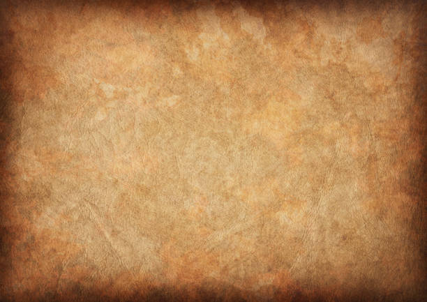

# U.S. Presidents Quiz

Welcome to the U.S. Presidents Quiz! This is a fun and challenging web-based game designed to test your knowledge of American history. Can you identify the U.S. presidents from their portraits before time runs out?

 <!-- You can replace this with a real screenshot of the game later -->

## ✨ Features

-   **10 Levels of Challenge:** The game takes you through 10 timed levels of increasing difficulty.
-   **Timed Guesses:** You have 10 seconds to identify the correct president in each level, adding a layer of excitement.
-   **Interactive Gameplay:** Click on the portrait that matches the president's name and years of service.
-   **Instant Feedback:** Get immediate visual feedback on your answers with colored borders and a confetti celebration for correct choices.
-   **Hall of Fame:** Your final score and total time are ranked! Compete for the top spot. The ranking is based on the highest score, with the fastest time as a tie-breaker.
-   **Answer Review:** At the end of the game, review your answers to see where you excelled and learn from your mistakes.
-   **Responsive Design:** Enjoy a seamless experience on both desktop and mobile devices.

## 🚀 Tech Stack

-   **Framework:** [Next.js](https://nextjs.org/)
-   **Language:** [TypeScript](https://www.typescriptlang.org/)
-   **Styling:** [Tailwind CSS](https://tailwindcss.com/)
-   **Fonts:** Google Fonts (`Lora` & `Pirata One`)

## 🛠️ Getting Started

To run this project locally, follow these simple steps:

1.  **Clone the repository:**
    ```bash
    git clone https://github.com/your-username/your-repo-name.git
    cd your-repo-name
    ```

2.  **Install dependencies:**
    ```bash
    npm install
    ```

3.  **Run the development server:**
    ```bash
    npm run dev
    ```

4.  Open [http://localhost:3000](http://localhost:3000) in your browser to start playing!

## ⭐ Like this project?

If you enjoyed playing this game or found the code helpful, please consider giving this repository a star! It's a great way to show your support. Thank you!