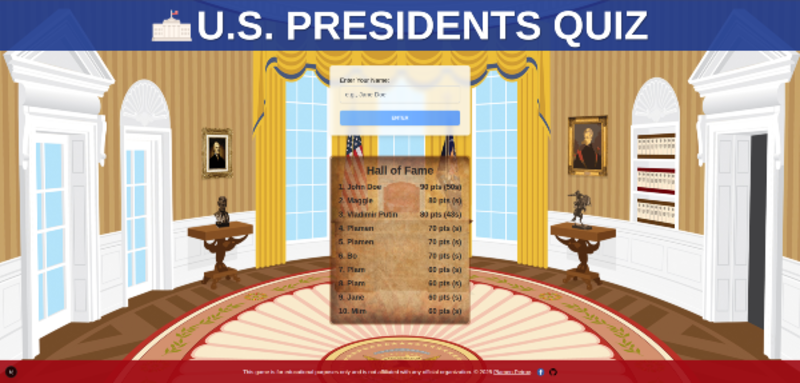

# 🇺🇸 U.S. Presidents Quiz


 

> A fun and educational browser game to test your knowledge of American presidents!


**Can you identify the U.S. presidents from their portraits before time runs out?**


## ✨ Features
- 🇺🇸 Guess presidents by photo or clues (years of service)
- 🧠 Tracks your score - best score & time enters you to the Hall of Fame
- 🕹️ Playable in-browser – no downloads
- 📱 Fully responsive design (still beter gameplay on destop, though)
- 🧾 Educational focus - play it a few times and you will learn them all. No kidding!

> If you enjoy the game or find it useful, please consider giving the repo a ⭐️ — it really helps!


## 🚀 Tech Stack

-   **Framework:** [Next.js](https://nextjs.org/)
-   **Language:** [TypeScript](https://www.typescriptlang.org/)
-   **Styling:** [Tailwind CSS](https://tailwindcss.com/)
-   **Fonts:** Google Fonts (`Lora` & `Pirata One`)

## 🛠️ Getting Started

To run this project locally, follow these simple steps:

1.  **Clone the repository:**
    ```bash
    git clone https://github.com/plamen5rov/presidents-quiz-gemini-cli
    cd your-repo-name
    ```

2.  **Install dependencies:**
    ```bash
    npm install
    ```

3.  **Run the development server:**
    ```bash
    npm run dev
    ```

4.  Open [http://localhost:3000](http://localhost:3000) in your browser to start playing!

## 🎮 Live Demo
[👉 Play the Game Here](https://github.com/plamen5rov/presidents-quiz-gemini-cli)  

## 👨‍💻 Author: **Plamen Petrov** – [@plamen5rov](https://github.com/plamen5rov)

## 📄 License
This project is licensed under the [MIT License](https://img.shields.io/badge/license-MIT-green)

## ⚠️ Disclaimer
This game is for educational and informational purposes only. It is not affiliated with or endorsed by any government agency or public office.

## ⭐ Like this project?

If you enjoyed playing this game or found the code helpful, please consider giving this repository a star! It's a great way to show your support. Thank you!

[](https://github.com/plamen5rov/presidents-quiz-gemini-cli/stargazers)

## 📈 Star History

[](https://www.star-history.com/#plamen5rov/presidents-quiz-gemini-cli&Date)

